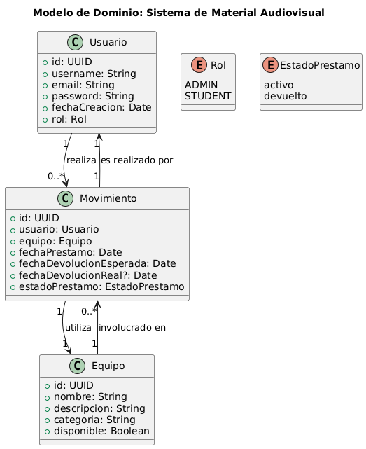
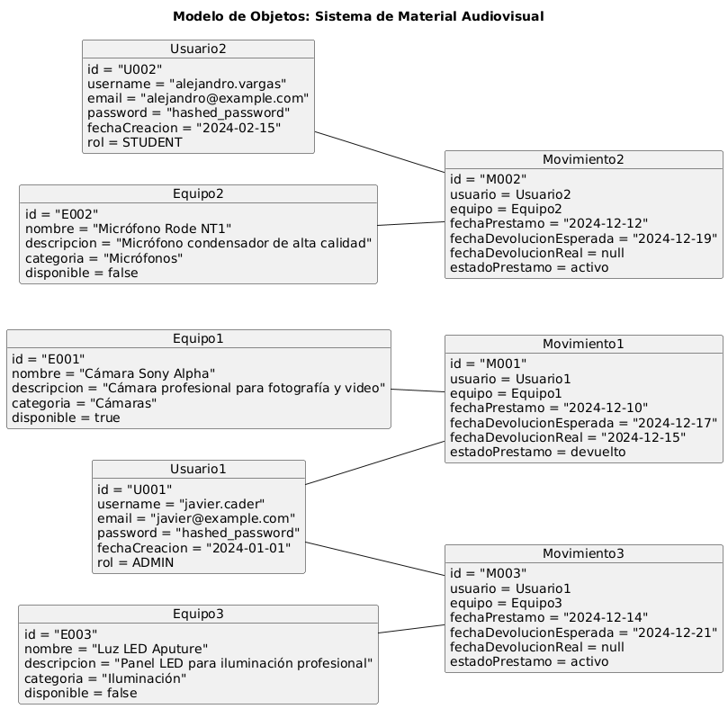
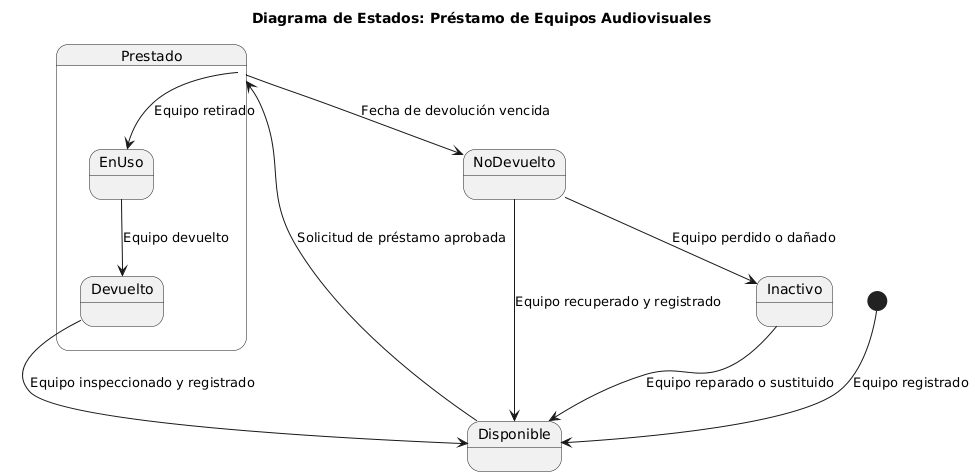
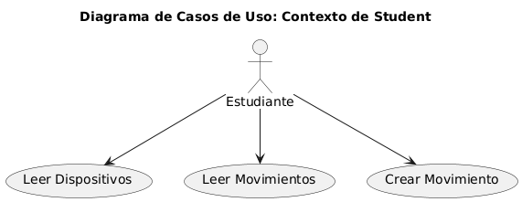
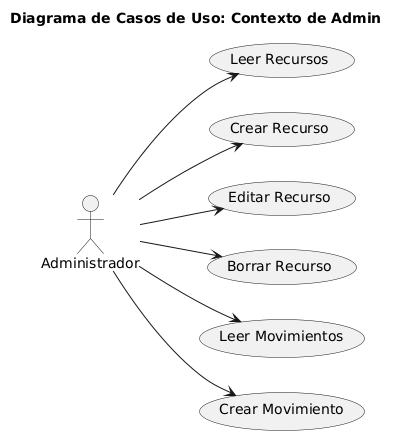
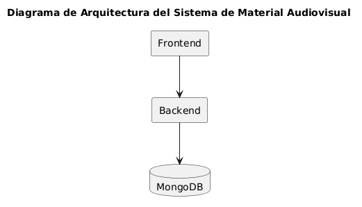

# Documentación del Sistema de Material Audiovisual

## Índice
1. [Introducción al Proyecto](#introducci%C3%B3n-al-proyecto)
2. [Objetivos del Proyecto](#objetivos-del-proyecto)
3. [Modelo de Dominio](#modelo-de-dominio)
   - [Diagrama de Clases](#diagrama-de-clases)
   - [Diagrama de Objetos](#diagrama-de-objetos)
   - [Diagrama de Estados](#diagrama-de-estados)
4. [Diagramas de Casos de Uso](#diagramas-de-casos-de-uso)
   - [Contexto de Student](#diagrama-de-casos-de-uso-contexto-de-student)
   - [Contexto de Admin](#diagrama-de-casos-de-uso-contexto-de-admin)
5. [Diagrama de Arquitectura](#diagrama-de-arquitectura)

## Introducción al Proyecto

El **"Sistema de Material Audiovisual"** es una plataforma diseñada para gestionar de manera eficiente el préstamo y devolución de equipos audiovisuales, garantizando un control adecuado de los recursos y facilitando la autenticación de los usuarios. Este sistema responde a la necesidad de modernizar y agilizar los procesos de administración, optimizando tanto la experiencia del usuario como la gestión interna del inventario.

En un contexto donde los equipos audiovisuales son esenciales para el ámbito académico y profesional, resulta fundamental contar con una solución tecnológica que permita registrar, monitorizar y supervisar su uso. El sistema no solo gestiona el flujo de préstamos, sino que también ofrece una funcionalidad robusta de autenticación para garantizar la seguridad y la trazabilidad de los equipos.

## Objetivos del Proyecto

1. **Objetivo General**:
   Diseñar e implementar un sistema que permita gestionar los préstamos y devoluciones de equipos audiovisuales de forma eficiente, minimizando errores y mejorando la experiencia del usuario.

2. **Objetivos Específicos**:
   - Automatizar el registro de préstamos y devoluciones de equipos audiovisuales.
   - Implementar un sistema de autenticación de usuarios basado en roles para garantizar el acceso seguro y controlado.
   - Ofrecer reportes detallados sobre el estado de los equipos, historial de préstamos y devoluciones.
   - Integrar notificaciones automáticas para recordar a los usuarios sobre préstamos activos y fechas de devolución.
   - Asegurar la disponibilidad de un inventario actualizado en tiempo real para evitar conflictos de disponibilidad.

## Modelo de Dominio

### Diagrama de Clases

- **Usuario**: Representa a las personas que interactúan con el sistema, con atributos como `id`, `username`, `email`, `password`, `fechaCreacion`, y su `rol`.
- **Rol**: Es una enumeración que define los tipos de usuarios (`ADMIN` y `STUDENT`).
- **Equipo**: Modela los dispositivos audiovisuales disponibles para préstamo, con atributos como `id`, `nombre`, `descripcion`, `categoria`, y `disponible`.
- **Movimiento**: Representa el préstamo o devolución de un equipo, relacionando un `Usuario` con un `Equipo`, y tiene atributos como `fechaPrestamo`, `fechaDevolucionEsperada`, `fechaDevolucionReal` y `estadoPrestamo`.
- **EstadoPrestamo**: Es una enumeración que define los posibles estados de un movimiento (`activo` o `devuelto`).

### Diagrama de Objetos

- Se modelaron varios objetos:
  - **Usuarios**: Javier (ADMIN) y Alejandro (STUDENT).
  - **Equipos**: Diferentes tipos de dispositivos con estados de disponibilidad variados.
  - **Movimientos**: Representan préstamos de equipos específicos con atributos relacionados a las fechas y estados de devolución.
- Las relaciones muestran cómo cada movimiento se asocia a un usuario y un equipo.

### Diagrama de Estados

- **Estados inicial y final**:
  - El estado inicial es `Disponible`, representando que el equipo está listo para préstamo.
- **Estados intermedios**:
  - `Prestado`: Cuando se aprueba un préstamo.
  - `EnUso`: Cuando el equipo ha sido retirado.
  - `Devuelto`: Cuando el equipo es regresado dentro del tiempo estimado.
  - `NoDevuelto`: Si el equipo no se devuelve a tiempo.
  - `Inactivo`: Si el equipo está dañado o perdido.
- **Transiciones**:
  - Incluyen eventos como "solicitud aprobada," "equipo devuelto," "fecha vencida," y "equipo reparado."
- El diagrama refleja la vida del equipo en el contexto del préstamo y devolución.

## Diagramas de Casos de Uso

### Diagrama de Casos de Uso: Contexto de Student

- **Actores**:
  - `Student` representa al usuario que tiene acceso al sistema para interactuar con los dispositivos y movimientos.
- **Casos de Uso**:
  - **Leer Dispositivos**: Permite al estudiante consultar la lista de equipos disponibles y sus detalles.
  - **Leer Movimientos**: Permite al estudiante ver el historial de préstamos y devoluciones en los que ha participado.
  - **Crear Movimiento**: Permite al estudiante iniciar un préstamo de un equipo disponible.

### Diagrama de Casos de Uso: Contexto de Admin

- **Actores**:
  - `Admin`: Representa al usuario administrador con permisos avanzados para gestionar los recursos y movimientos.
- **Casos de Uso**:
  - **Leer Recursos**: Permite consultar la lista de equipos y sus detalles.
  - **Crear Recurso**: Permite añadir un nuevo equipo al sistema.
  - **Editar Recurso**: Permite modificar la información de un equipo existente.
  - **Borrar Recurso**: Permite eliminar un equipo del sistema.
  - **Leer Movimientos**: Permite consultar el historial completo de préstamos y devoluciones.
  - **Crear Movimiento**: Permite iniciar un préstamo de un equipo.

## Diagrama de Arquitectura

- **Frontend**:
  - Representado por `Next.js Application`, que interactúa con los usuarios finales.
  - Se comunica con la API mediante solicitudes HTTP RESTful para realizar acciones como leer dispositivos o movimientos, y crear movimientos.
- **Backend**:
  - Representado por `Express API`, que expone los endpoints necesarios para la lógica del negocio.
  - Maneja las solicitudes del frontend y ejecuta las operaciones correspondientes en la base de datos.
- **Base de Datos**:
  - Representado por `MongoDB`, que almacena los datos del sistema, incluyendo información de usuarios, dispositivos y movimientos.
  - La comunicación entre la API y la base de datos se realiza usando Mongoose para operaciones CRUD.
- **Relaciones**:
  - El Frontend se conecta con el Backend para enviar y recibir datos.
  - El Backend interactúa con la base de datos para gestionar la persistencia de los datos.